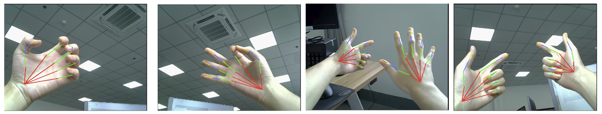

# A Lightweight Real-Time 3D Hand Gesture Tracking Solution for Mobile Devices

## Abstract
Gesture tracking is crucial for AR device human-computer interactions. Although many deep learning-based methods offer notable accuracy, their extensive parameters limit efficiency, challenging real-time deployments on low-power platforms. We present a lightweight, real-time 3D gesture tracking solution that determines hand positions and keypoints from a single RGB image in AR/VR devices. Using a two-stage algorithm, the initial stage identifies a hand's bounding frame. This frame then guides the second stage to detect 3D hand joint coordinates. These coordinates, once adjusted for camera parameters, yield the camera coordinates for hand keypoints. Our solution is optimized for low-power platforms, such as the RK3588 board, enabling real-time inferences with high detection quality
<p align="middle">
    
</p>

## Running InterNet
### Start
* In the `main/config.py`, you can change settings of the model including dataset to use and which root joint translation vector to use (from gt or from [RootNet](https://github.com/mks0601/3DMPPE_ROOTNET_RELEASE)).

### Train
In the `main` folder, run train.py
```bash
python train.py --gpu 0-3
```
to train the network on the GPU 0,1,2,3. `--gpu 0,1,2,3` can be used instead of `--gpu 0-3`. If you want to continue experiment, run use `--continue`. 


### Test
Place trained model at the `output/model_dump/`.

In the `main` folder, run test.py
```bash
python test.py --gpu 0-3 --test_epoch 0/1
```
to test the network on the GPU 0,1,2,3 with `snapshot_{0/1}.pth`.  `--gpu 0,1,2,3` can be used instead of `--gpu 0-3`.

0: the best model    1 : the final model

### ToONNX
In the `main` folder, run toonnx.py
```bash
python toonnx.py
```
